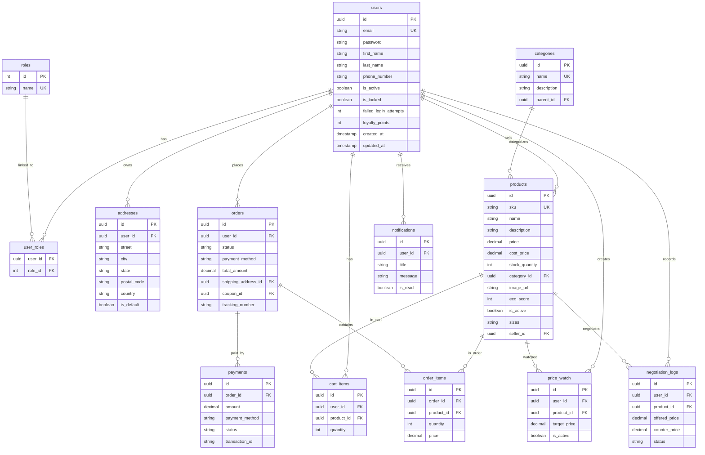

# ShopGenius — Next-Gen Smart E-Commerce Platform

ShopGenius is an enterprise-ready, highly scalable e-commerce marketplace platform built using a modern decoupled architecture. Beyond standard e-commerce services, ShopGenius features an **interactive AI pricing negotiator**, **algorithmic fraud checking**, a **dedicated Seller Marketplace Hub**, and **auto-reverting transactional inventory controls**.

---

## 🚀 Key Features

### 1. Interactive AI Negotiation Desk
Allows customers to bargain on prices live using a rule-based AI agent:
- **Margin Protection**: Automatically blocks any negotiations below the product's `costPrice` (wholesaler cost).
- **Concession Damping**: Calculates counter-offers based on the delta between catalog retail price and user offer:
  $$\text{Counter Price} = \text{Retail Price} - (\text{Retail Price} - \text{Offered Price}) \times \gamma$$
- **Loyalty Integration**: Damping factor $\gamma$ is lowered (granting larger discounts) if the user has accumulated loyalty points.

### 2. Full Seller Marketplace Portal (Seller Hub)
Any registered user can become a seller and access the **Seller Hub**:
- **Store Performance**: Tracks Gross Sales Revenue and Dispatched Items. Calculations whitelist completed order states (`PAID`, `SHIPPED`, `DELIVERED`) to prevent failed or pending payments from inflating store metrics.
- **Inventory CRUD**: Manage listings, update product pricing, modify stock quantities, categories, and sizing details.
- **Stock Warnings**: Flags inventory alerts if stock levels drop below 5 units.

### 3. Payment Reversion & Retry Stock Locks
- **Reversion on Failure**: If a payment fails, the system automatically runs a reversion routine, returning the locked order quantities back to the product's available inventory.
- **Retry Locking**: If a customer retries a payment on a failed order, the system checks catalog stock levels and locks the quantities again before processing the transaction to prevent overselling.

### 4. Algorithmic Fraud Detection
- Calculates a fraud risk score (0-100) before finalizing transactions based on user order values, high-frequency checkout thresholds, and failed login histories.
- High-risk checkouts ($\ge 80$) are blocked.

### 5. Automated Cart Recovery & Rewards
- Tracks abandoned carts. If a user returns and completes their checkout, the cart event is marked as `recovered`.
- Successful paid checkouts award loyalty rewards points (10% of order value) back to the user profile.

---

## 🏗️ Architecture & Tech Stack

The project relies on a decoupled, Clean Architecture model split into a stateless Java backend and static frontend.

```
┌────────────────────────────────────────────────────────┐
│                   Presentation Layer                   │
│         (HTML5, Vanilla CSS, SPA Router in JS)         │
└───────────────────────────┬────────────────────────────┘
                            │ (JSON REST APIs)
                            ▼
┌────────────────────────────────────────────────────────┐
│                   Controller Layer                     │
│    (Spring Boot @RestController, Unified ApiResponse)   │
└───────────────────────────┬────────────────────────────┘
                            │ (DTOs / Mappers)
                            ▼
┌────────────────────────────────────────────────────────┐
│                     Service Layer                      │
│     (Spring @Service, Transaction Management, Heuristics)│
└───────────────────────────┬────────────────────────────┘
                            │ (Spring Data JPA)
                            ▼
┌────────────────────────────────────────────────────────┐
│                   Persistence Layer                    │
│      (Spring Repository, PostgreSQL / H2 Database)     │
└────────────────────────────────────────────────────────┘
```

### Backend Dependencies
- **JDK 21** & **Spring Boot 3.x**
- **Spring Security** (Stateless authentication with JWT Access/Refresh Token rotation)
- **Hibernate / Spring Data JPA**
- **Database**: H2 (In-memory development) and PostgreSQL (Production)
- **MapStruct** & **Lombok** (Compile-time code generation for boilerplate reduction)
- **Flyway** (Database schema migrations)

### Frontend Dependencies
- **HTML5** & **Vanilla CSS** (Vibrant gradients, glassmorphism, responsive grid layouts)
- **Vanilla JavaScript** (Static SPA router, state store, and Fetch API HTTP client with automatic silent JWT token refresh)

---

## 📊 Database Schema (ERD)



---

## 🛠️ Local Development & Execution

### 1. Compile the Backend
Navigate to the `backend` folder and compile using the local maven executable:
```bash
& "maven/apache-maven-3.9.6/bin/mvn.cmd" clean compile
```

### 2. Start the Backend Server
Start the Spring Boot server (uses H2 in-memory profile by default in dev):
```bash
& "maven/apache-maven-3.9.6/bin/mvn.cmd" spring-boot:run
```
The server will start at `http://localhost:8080`. Initial categories, products, coupons, and an admin user will be seeded automatically.
- **Admin Username**: `admin@shopgenius.com`
- **Admin Password**: `admin123`

### 3. Start the Frontend Dev Server
In a separate terminal, serve the frontend static folder:
```bash
npx -y http-server frontend -p 3000
```
Open [http://127.0.0.1:3000](http://127.0.0.1:3000) in your web browser.

---

## ☁️ Deployment (Render Orchestration)
The repository includes a `render.yaml` blueprint configuring:
- **`shopgenius-db`**: Managed PostgreSQL database.
- **`shopgenius-redis`**: Managed Redis cache.
- **`shopgenius-backend`**: Docker runtime executing Spring Boot.
- **`shopgenius-frontend`**: Static web server serving frontend static assets.
Pushing commits to the `main` branch on GitHub automatically triggers a rolling rebuild and deployment cycle on Render.
