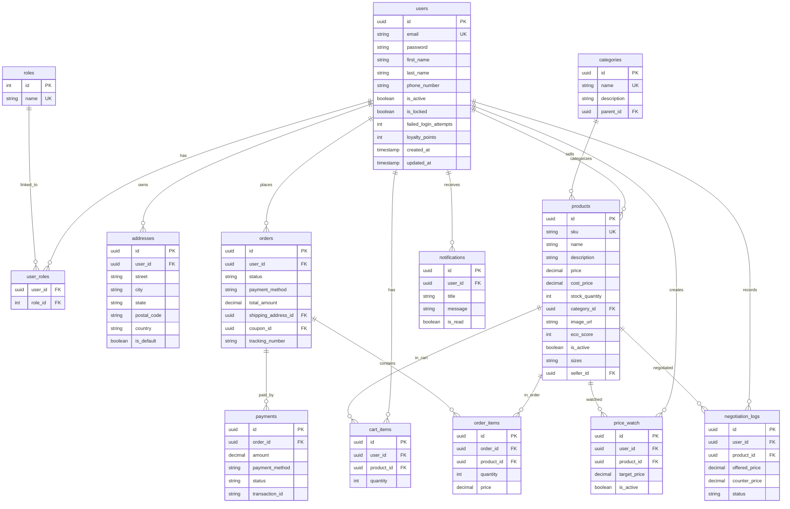

# ShopGenius Enterprise Platform Documentation

---

## 1. Executive Summary & Overview

ShopGenius is a modern, highly scalable, enterprise-ready smart e-commerce platform. Unlike conventional e-commerce solutions, ShopGenius is built from the ground up to integrate **real-time AI price negotiations**, **algorithmic behavior analysis (Fraud Detection)**, and a **complete Seller Marketplace** where any registered user can list products, track sales revenue, monitor inventory levels, and configure cost margins.

### Vision and Objectives
Conventional e-commerce transactions are rigid; buyers either accept a listed price or leave the cart. ShopGenius introduces an interactive **AI Price Bargainer** that simulates a digital retail agent, enabling dynamic pricing without compromising business margins. Key objectives include:
- **Price Optimization**: Driving conversion on high-value items through real-time dialogue.
- **Security & Integrity**: Mitigating bad actors through heuristic behavioral checking and JWT protection.
- **Seller Empowerment**: Providing high-fidelity sales dashboards, low-stock warnings, and inventory control.
- **Sustainability Highlights**: Scoring products via an **Eco Score** algorithm to promote sustainable shipping and packaging.

---

## 2. Architecture & Design Philosophy

The application utilizes a **Clean Architecture** model with strict segregation between data, business logic, and presentation layers. It adheres to **SOLID** software engineering principles.

```
┌────────────────────────────────────────────────────────┐
│                   Presentation Layer                   │
│         (HTML5, Vanilla CSS, SPA Router in JS)         │
└───────────────────────────┬────────────────────────────┘
                            │ (JSON REST APIs)
                            ▼
┌────────────────────────────────────────────────────────┐
│                   Controller Layer                     │
│    (Spring Boot @RestController, Unified ApiResponse)   │
└───────────────────────────┬────────────────────────────┘
                            │ (DTOs / Mappers)
                            ▼
┌────────────────────────────────────────────────────────┐
│                     Service Layer                      │
│     (Spring @Service, Transaction Management, Heuristics)│
└───────────────────────────┬────────────────────────────┘
                            │ (Spring Data JPA)
                            ▼
┌────────────────────────────────────────────────────────┐
│                   Persistence Layer                    │
│      (Spring Repository, PostgreSQL / H2 Database)     │
└────────────────────────────────────────────────┘
```

### Design Principles

1. **Package-by-Feature (Clean Architecture)**
   Instead of grouping classes by horizontal layers (e.g., all controllers in one folder, all services in another), ShopGenius groups all files by feature area (e.g., `com.shopgenius.product`, `com.shopgenius.order`, `com.shopgenius.seller`). This increases cohesion, makes code modifications modular, and prevents tight coupling.

2. **Decoupled Data Flow (DTO Pattern)**
   Entities are kept hidden from client requests to secure DB schema layouts. Mappers (via **MapStruct**) translate database entity objects into Data Transfer Objects (DTOs) before sending responses back over the wire.

3. **Stateless JWT Security**
   Authentication is completely stateless. Every incoming request must provide a valid JSON Web Token (JWT) in the `Authorization: Bearer <token>` header. Token rotation is managed via secure HTTP-only refresh tokens.

4. **Global Exception Handling**
   All run-time exceptions are intercepted by a global controller advisor (`@RestControllerAdvice`) that translates java errors into uniform HTTP error objects with detailed statuses.

---

## 3. Technology Stack & Dependencies

### Backend Technology Stack

- **Java Development Kit (JDK) 21**: Leveraging modern language features like Record types, pattern matching, and enhanced text blocks.
- **Spring Boot 3.x**: Serves as the core runtime environment, utilizing Web, JPA, Security, AOP, and Validation starters.
- **Spring Security**: Configures the HTTP security filter chains, CORS policies, JWT interceptor filters, and role-based path permissions.
- **Database (H2 & PostgreSQL)**: 
  - *Development Profile*: Memory-resident H2 database for zero-configuration startup.
  - *Production Profile*: Robust PostgreSQL database.
- **Flyway**: Database migrations runner managing schema upgrades sequentially.
- **MapStruct**: Annotation-driven bean-mapper generating lightning-fast mapping implementations.
- **Lombok**: Boilerplate reducer generating getters, setters, builders, and constructor injections automatically.
- **SpringDoc OpenAPI (Swagger)**: Automatically generates comprehensive REST endpoint documentation.

### Frontend Technology Stack

- **HTML5 (Semantic Layout)**: Using modern HTML tags (`<header>`, `<main>`, `<section>`) to support accessibility and SEO tags.
- **Vanilla CSS (Aesthetics & Theme)**: 
  - Structured using standard CSS Custom Properties (Variables) for easy theme manipulation.
  - Utilizes smooth visual gradients, glassmorphism filters (`backdrop-filter: blur()`), responsive CSS Grids, and micro-animations.
- **Vanilla JavaScript SPA Router**:
  - Implements hash-change listeners (`#products`, `#cart`, `#sell`, etc.) to switch layouts instantly without page reloads.
  - Incorporates state tracking, dynamic template literal injection, and standard asynchronous REST calling.

---

## 4. Database Schema & Relationships

### Enterprise Entity Relationship Diagram (ERD)

The database schema manages user accounts, inventories, order lifecycles, and interactive modules. Below is the Mermaid ER Diagram:



---

## 5. Feature Details & Core Implementation

### 5.1 Security & Authentication (`com.shopgenius.security`)
Security uses a JWT-based stateless architecture. 
- **Filters**: `JwtAuthenticationFilter` intercepts every incoming HTTP call, extracts the header, checks for `Bearer <JWT>`, validates signatures using a secret key, and places the principal in Spring Security's context.
- **BCrypt Encryption**: Passwords are secure-salted and hashed via standard BCrypt matching.
- **JWT Rotation**: When the access token expires, a refresh endpoint accepts `refreshToken` to grant a fresh token.

### 5.2 Category & Product Catalog (`com.shopgenius.product`)
- **SKU Validation**: Every product must have a unique Stock Keeping Unit (SKU) to prevent tracking collisions.
- **Sustainability (Eco Score)**: Every catalog item can receive a rating between 0 and 100 representing its package recyclability, manufacturing source, and logistics carbon footprint.
- **Sizes**: Text-based comma-separated values (e.g. `S,M,L,XL`) are supported for easy rendering in size selector badges.

### 5.3 Shopping Cart & Discount Coupons (`com.shopgenius.cart`)
- **Cart Calculations**: Calculates subtotal, discounts (percentage or fixed amount), taxes, and final prices in real-time.
- **Abandoned Cart Detection**: If a user logs out or leaves items in their cart for a prolonged period, an background event is logged. If the user subsequently places the order, the event is marked as `recovered`.

### 5.4 Order & Checkout Processing (`com.shopgenius.order`)
- **Stock Lock**: Once an order is placed, stock quantities are immediately deducted to prevent double-ordering.
- **Order Status Flow**: States move through `PENDING` -> `PAID` / `FAILED` -> `SHIPPED` -> `DELIVERED` -> `CANCELLED`.
- **Loyalty Program**: Successful `PAID` checkouts credit loyalty points (10% of total invoice value) back to the customer's user account.

### 5.5 Payment Processing & Auto-Reversion (`com.shopgenius.payment`)
- **Mock Payment Gateway**: Simulates connection responses.
- **Reversion on Failures**: If a payment transaction fails, the application automatically initiates stock reversion—incrementing the inventory stock quantities of all items in the order back to the catalog.
- **Retry Deductions**: If a user attempts to pay again for an order marked as `FAILED`, the code re-validates catalog quantities and locks the stock again before processing.

### 5.6 Interactive AI Negotiation Engine (`com.shopgenius.negotiation`)
ShopGenius incorporates a smart rule-based pricing negotiation desk:
- **Heuristic Countering**: When a user inputs an offer, the AI engine evaluates the offer price against the product's listed retail price and its internal `costPrice` (marginal safety net).
- **Rule Matrix**:
  - If the offer is above the retail price or very close to it (>= 95% of retail price), the AI accepts immediately.
  - If the offer is below the product's `costPrice`, the AI rejects immediately, citing that the price is below operating costs.
  - If the offer lies between `costPrice` and retail, the engine uses a counter-offer algorithm:
    $$\text{Counter Price} = \text{Retail Price} - (\text{Retail Price} - \text{Offered Price}) \times \gamma$$
    Where $\gamma$ is a damping modifier (e.g., 0.6) influenced by the user's loyalty points and current catalog inventory levels.
  - If a price is accepted by the AI, the customer can place that product in their cart directly at the accepted bargaining price!

### 5.7 Automated Fraud Detection (`com.shopgenius.fraud`)
Every completed checkout passes through the **Fraud Detection Engine**:
- Evaluates risk score (0.0 to 100.0) based on:
  - Account age.
  - Invoice value matches.
  - High-frequency checkout requests.
  - Failed login attempts.
- If the risk evaluation falls into `HIGH` (score >= 80), the checkout transaction is instantly blocked, throwing a security exception back to the client.

### 5.8 Seller Hub & Marketplace Management (`com.shopgenius.seller`)
Any registered user can click **Sell on ShopGenius** in the navigation header to open their personalized seller portal:
- **Gross Revenue Tracking**: Sums total revenue from successful sales. Only counts orders in status `PAID`, `SHIPPED`, or `DELIVERED` (excludes `FAILED`, `PENDING`, or `CANCELLED`).
- **Dispatches Tracker**: Tracks total quantities of shipped items.
- **Listing Administrator**: Allows sellers to add new items (configuring custom SKU, retail price, cost price, and stock levels), update current listings, or delete active listings.
- **Inventory Alerts**: Prominently highlights stock warnings when item stock drops below 5 units.

---

## 6. Frontend Architecture & Flow

The frontend is an optimized **Single Page Application (SPA)** written in vanilla HTML5, CSS3, and JavaScript.

```
                  ┌──────────────────────────────┐
                  │      hashchange Listener     │
                  └──────────────┬───────────────┘
                                 ▼
                  ┌──────────────────────────────┐
                  │     Router: navigate()       │
                  └──────────────┬───────────────┘
                                 ▼
                  ┌──────────────────────────────┐
                  │    State Check: initAuth()   │
                  └──────────────┬───────────────┘
                                 ▼
         ┌───────────────────────┴───────────────────────┐
         ▼                                               ▼
  [ Guest State ]                              [ Authenticated State ]
┌─────────────────────────┐                   ┌─────────────────────────┐
│  - Render Products      │                   │  - Render Products      │
│  - Render Auth View     │                   │  - Render Cart/Checkout │
│  - Sell Promo Banner    │                   │  - Render Order History │
└─────────────────────────┘                   │  - Render Profile View  │
                                              │  - Render Seller Hub    │
                                              └─────────────────────────┘
```

### Core JavaScript Modules (Inside `app.js`)

1. **State Store (`state`)**: Global Javascript object keeping track of user credentials, active token, active route, cart list, categories cache, search filters, and live negotiation records.
2. **API Communicator (`apiCall`)**: Wraps the standard `fetch()` API. Handles authentication headers dynamically, injects tokens, intercepts `401 Unauthorized` responses, and performs silent token refresh using HTTP refresh token rotation endpoints automatically.
3. **Route Resolver (`renderView`)**: Checks hash values (`#products`, `#cart`, `#orders`, `#sell`, `#profile`) and swaps HTML elements using template literals.
4. **Toast Manager (`showToast`)**: Visual popup alerts for warning, success, error, and info triggers.
5. **Modal Handlers**: Renders glassmorphic modal popups dynamically for details, address submissions, and product editing.

---

## 7. Complete REST API Specifications

All endpoints return a standardized wrapping JSON schema:
```json
{
  "success": true,
  "data": { ... },
  "message": "Operation description",
  "timestamp": "2026-06-02T12:00:00Z"
}
```

### 7.1 Authentication Endpoints (`/api/auth`)

| Method | Endpoint | Description | Auth Required | Request Body DTO |
| :--- | :--- | :--- | :--- | :--- |
| **POST** | `/api/auth/register` | Register a new user account | No | `UserRegisterDto` |
| **POST** | `/api/auth/login` | Login and receive JWT access/refresh tokens | No | `UserLoginDto` |
| **POST** | `/api/auth/refresh` | Rotate access token using a refresh token | No | `TokenRefreshRequest` |

### 7.2 Product Catalog Endpoints (`/api/products`)

| Method | Endpoint | Description | Auth Required | Request Body DTO |
| :--- | :--- | :--- | :--- | :--- |
| **GET** | `/api/products` | Retrieve pageable list of all products | No | *Page parameters* |
| **GET** | `/api/products/{id}` | Retrieve individual product details | No | *None* |
| **GET** | `/api/products/search`| Search products by name (case-insensitive) | No | `?name=string` |
| **GET** | `/api/products/category/{catId}` | Get products in a specific category | No | *None* |

### 7.3 Cart & Coupons Endpoints (`/api/cart`)

| Method | Endpoint | Description | Auth Required | Request Body DTO |
| :--- | :--- | :--- | :--- | :--- |
| **GET** | `/api/cart` | Get current user's cart (applies coupon) | Yes | `?couponCode=string` |
| **POST** | `/api/cart/items` | Add an item to the cart | Yes | `CartItemAddDto` |
| **PUT** | `/api/cart/items/{id}` | Update quantity of item in cart | Yes | `CartItemQtyDto` |
| **DELETE**| `/api/cart/items/{id}` | Remove item from cart | Yes | *None* |

### 7.4 Order & Checkout Endpoints (`/api/orders`)

| Method | Endpoint | Description | Auth Required | Request Body DTO |
| :--- | :--- | :--- | :--- | :--- |
| **POST** | `/api/orders` | Checkout cart, lock stock, create order | Yes | `OrderCreateDto` |
| **GET** | `/api/orders` | Fetch user's order history | Yes | *Page parameters* |
| **GET** | `/api/orders/{id}` | Fetch details of a single order | Yes | *None* |

### 7.5 Payment Gateways Endpoints (`/api/payments`)

| Method | Endpoint | Description | Auth Required | Request Body DTO |
| :--- | :--- | :--- | :--- | :--- |
| **POST** | `/api/payments` | Process order payment (triggers stock check) | Yes | `PaymentRequestDto` |

### 7.6 Price Alerts Endpoints (`/api/price-watch`)

| Method | Endpoint | Description | Auth Required | Request Body DTO |
| :--- | :--- | :--- | :--- | :--- |
| **POST** | `/api/price-watch` | Create target price drop watcher | Yes | `PriceWatchRequestDto` |
| **GET** | `/api/price-watch` | Fetch user's active watchers | Yes | *None* |
| **DELETE**| `/api/price-watch/{id}` | Cancel/delete a price watcher | Yes | *None* |

### 7.7 Interactive Negotiation Endpoints (`/api/negotiations`)

| Method | Endpoint | Description | Auth Required | Request Body DTO |
| :--- | :--- | :--- | :--- | :--- |
| **POST** | `/api/negotiations` | Offer a price to the AI engine | Yes | `NegotiationOfferDto` |

### 7.8 Seller Marketplace Endpoints (`/api/seller`)

| Method | Endpoint | Description | Auth Required | Request Body DTO |
| :--- | :--- | :--- | :--- | :--- |
| **GET** | `/api/seller/dashboard` | Fetch gross revenue, dispatches, alert lists | Yes | *None* |
| **GET** | `/api/seller/products` | Fetch current seller's products | Yes | *Page parameters* |
| **POST** | `/api/seller/products` | Create/list a new product for sale | Yes | `ProductCreateDto` |
| **PUT** | `/api/seller/products/{id}`| Edit details of listed product | Yes | `ProductCreateDto` |
| **DELETE**| `/api/seller/products/{id}`| Delete/delist a product | Yes | *None* |

---

## 8. Development & Installation Guide

### Prerequisites
- **Java 21 JDK** installed on the development machine.
- **Node.js** (v18 or higher) for local server execution.
- **Maven 3.9.x** (or use the packaged binary inside `maven/apache-maven-3.9.6`).

### Running the Application

1. **Verify and Compile the Backend**:
   Navigate to the `backend` folder and compile using the local maven executable:
   ```bash
   & "maven/apache-maven-3.9.6/bin/mvn.cmd" clean compile
   ```

2. **Start the Backend Server**:
   Start the Spring Boot server using H2 in-memory profile (default in dev):
   ```bash
   & "maven/apache-maven-3.9.6/bin/mvn.cmd" spring-boot:run
   ```
   The backend will bootstrap, setup H2 in-memory databases, validate Hibernate schemas, and seed initial mock products, categories, coupons, and administration accounts. It listens at `http://localhost:8080`.

3. **Serve the Frontend**:
   Serve the static frontend pages:
   ```bash
   npx -y http-server frontend -p 3000
   ```
   Open [http://127.0.0.1:3000](http://127.0.0.1:3000) in your web browser.

4. **Verify Seeding & Credentials**:
   Log in with the seeded accounts:
   - **User Username**: `admin@shopgenius.com`
   - **User Password**: `admin123`
